**User Guide to HPB DCPP**

**HPB Foundation**

**July 2021**

**Content**

[**I.** **Introduction**](#_Toc90596917)

[**II. User Guide to HPB DCPP**](#_Toc90596919)

[1. **Create and back up a Privacy Wallet**](#_Toc90596920)

[**2. Import the Privacy Wallet**](#_Toc90596921)

[**3. Management and Asset Transfer Operation Process of Privacy
Currency**](#_Toc90596922)

[**4. Delete the Privacy Wallet**](#_Toc90596923)

## **Introduction**

## DCPP (Decentralized Confidential Payment Protocol) is a confidential payment solution that integrates hardware and software to achieve better efficiency and security. The software component is based on the smart contract named ZSC that is deployed at HPB blockchain. The hardware component is combined with the unique BOE acceleration chip of HPB, allowing the fast execution of zero-knowledge proof algorithms. DCPP provides confidential tokens with the ElGamal public key as an account, which serves as the carrier for HPB confidential transactions.

## 

## **II. User Guide to HPB DCPP**

## 1. Create and back up a Privacy Wallet

1.1 Click HPB Wallet and enter into the main interface.

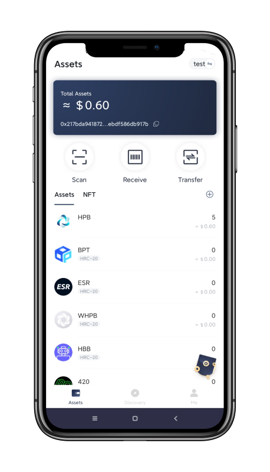

1.2 Click 【Me】- 【Manage Wallet】

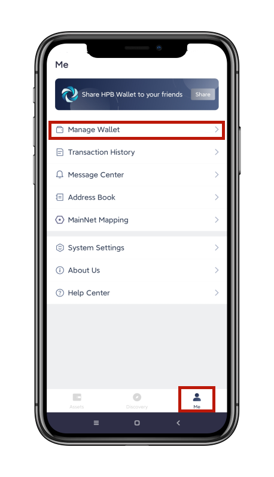

1.3 Click the【Privacy】tab -【Create a wallet】

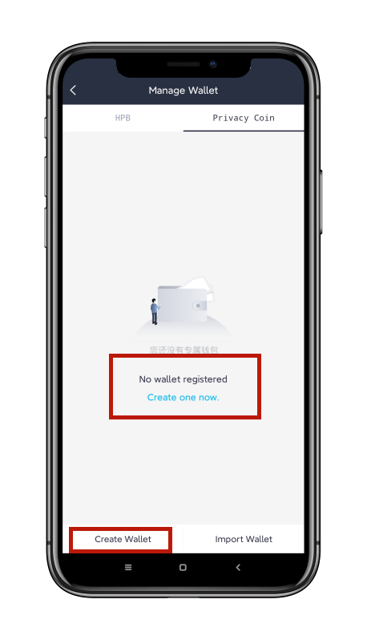

1.4 Fill in the related information as required, read the *Privacy Policy and
Terms of Service* and tick it, then click 【Create Wallet】.

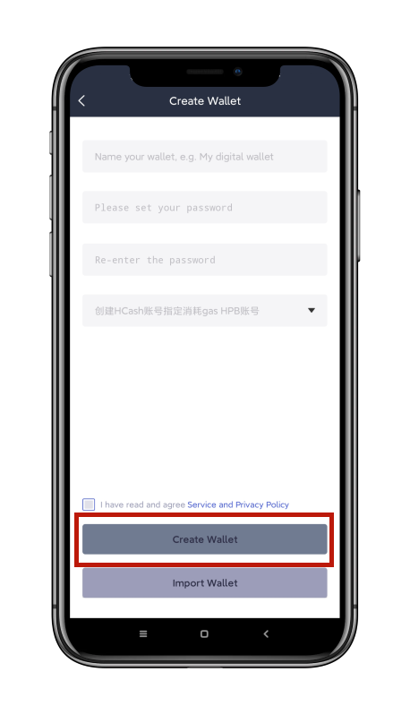

1.5 By now the wallet has been created successfully.

## **2. Import the Privacy Wallet**

2.1 Click 【Import Wallet】

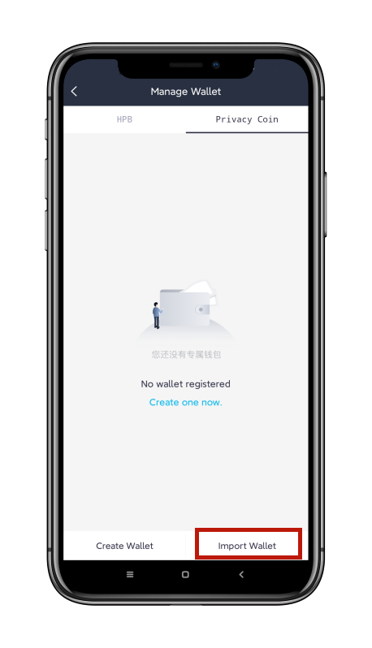

2.2 Input the plaintext private key and confirm it; before importing the Wallet,
please read the *Privacy Policy and Terms of Service* carefully and then tick
it. Click 【Confirm】.

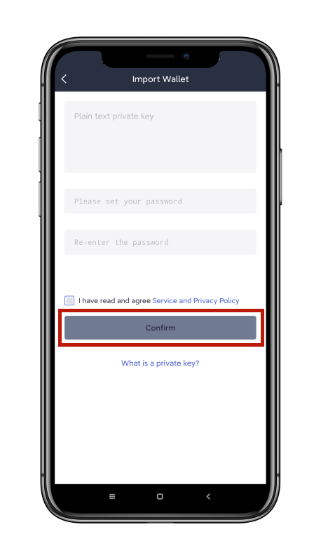

2.3 Congratulations! Your Privacy Wallet has been imported successfully.

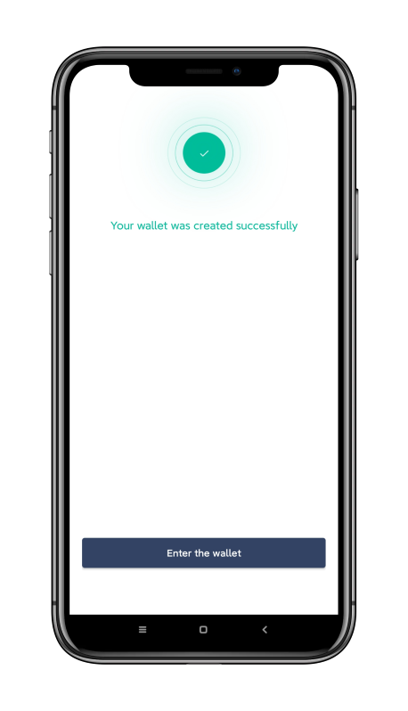

## **3. Management and Asset Transfer Operation Process of Privacy Currency**

3.1 On the【Assets】homepage，click the switch symbol top right, or
click【Me】-【Manage Wallet】-【Privacy 】 to manage the Privacy Currency.

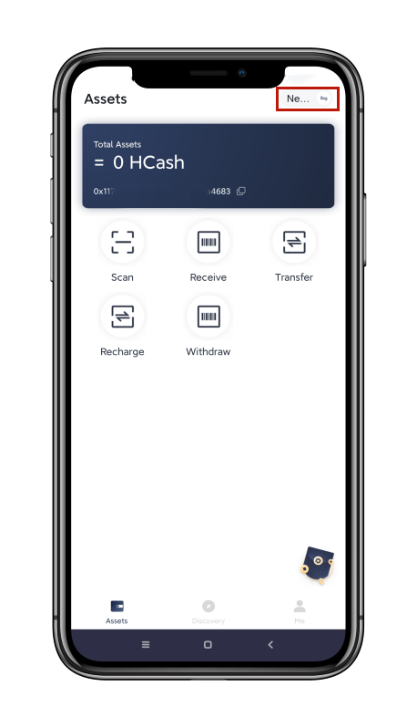

3\. 2.1 How to deposit Privacy Currency: on the homepage of the Privacy Wallet,
click 【Deposit】

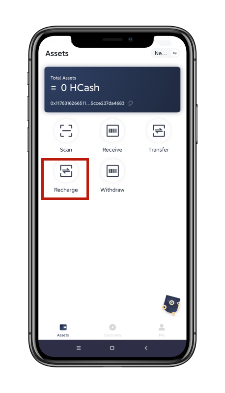

3\. 2.2 Fill in the related information as required, then click 【Deposit】.

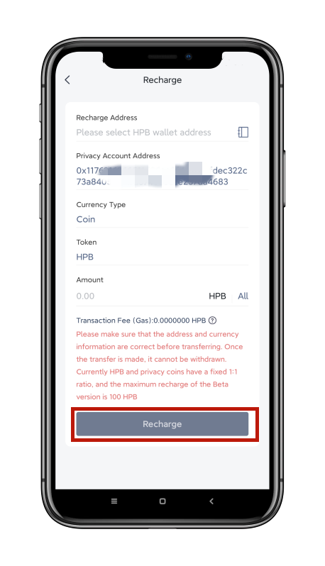

3\. 2.3 At the interface of confirming Deposit, check carefully if the
information has any mistakes; if any, please click 【×】 to return and correct
this information. After confirming that everything is correct, click【Confirm】,
input the password. Return to the homepage when deposit is done.

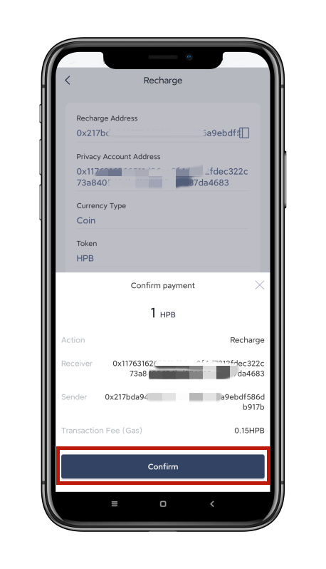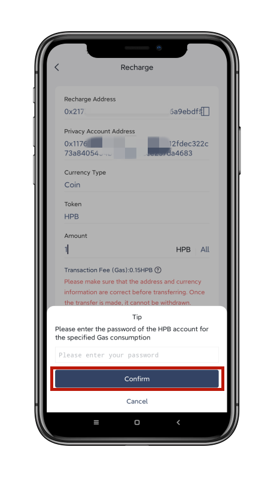

3\. 3.1 Instruction for asset transfer of the Privacy Currency Assets: On the
Wallet homepage, click 【Scan】(to scan an HPB wallet address QR code for
receiving payment) or click 【Transfer】.

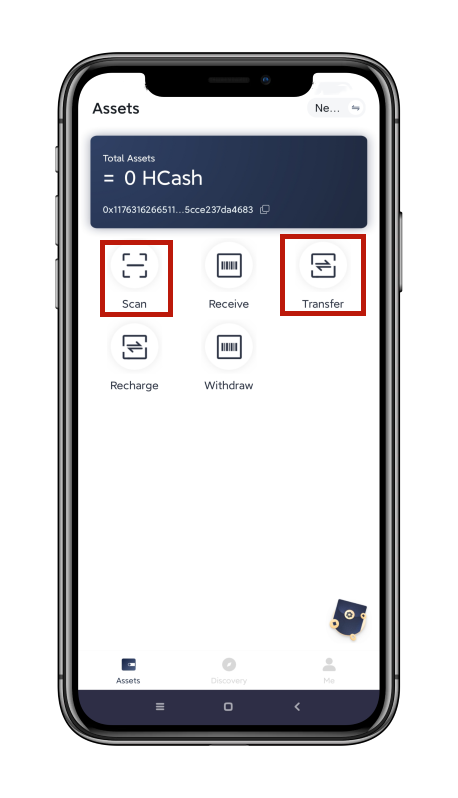

3\. 3.2 Input the wallet address you are transferring privacy currency to and
make sure your sender wallet account balance is sufficient (note - leave at
least 0.01 HPB to pay for gas to process the transaction in the related HPB
wallet), input the amount to be transferred, and then click【Transfer】.

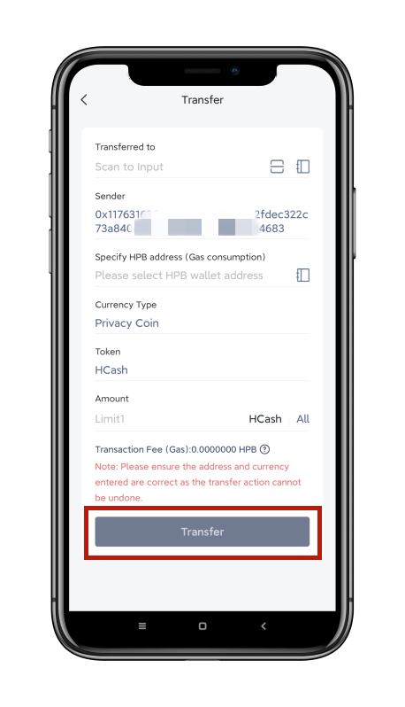

3\. 3.3 After carefully confirming that the transfer information is all correct,
click【Confirm】, input your HPB payment password (for your HPB wallet with
positive balance) and the Privacy Currency payment password separately, and
return to the homepage after making the transfer successfully.

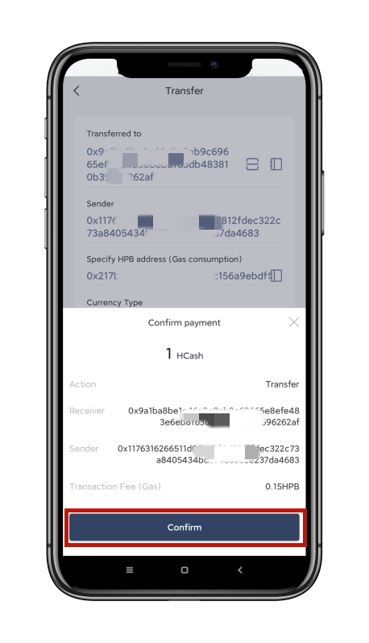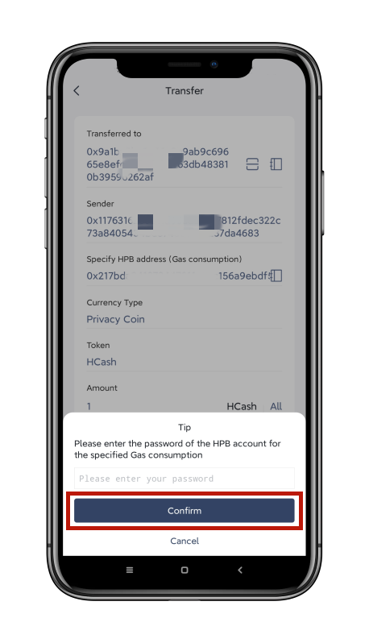

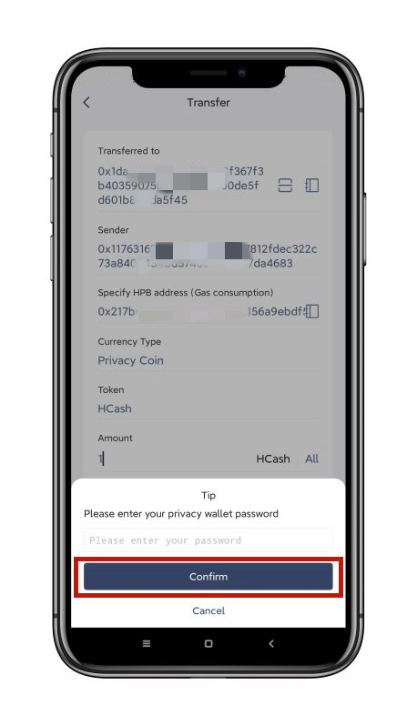

3\. 4.1 Instruction for withdrawing the Privacy Currency: on the homepage of
Wallet, click 【Withdraw】 and enter into the withdrawal interface.

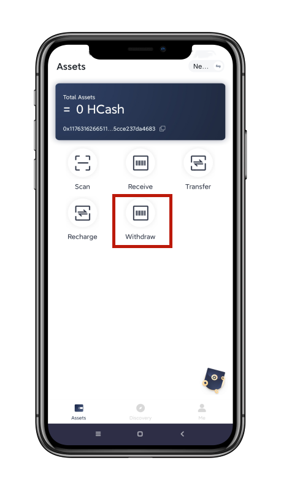

3\. 4.2 Fill in the related information as required, then click 【Withdraw】.

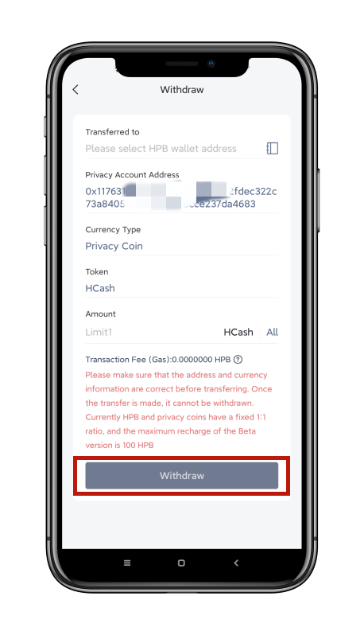

3\. 4.3 At the page of confirming withdrawal, carefully check if the withdrawal
information is correct; if so, click 【×】 to return and correct the withdrawal
information. Click 【Confirm】 after confirming that everything is right; then
input the HPB payment password and Privacy Currency payment passwords
separately. Return to the homepage after withdrawing successfully.

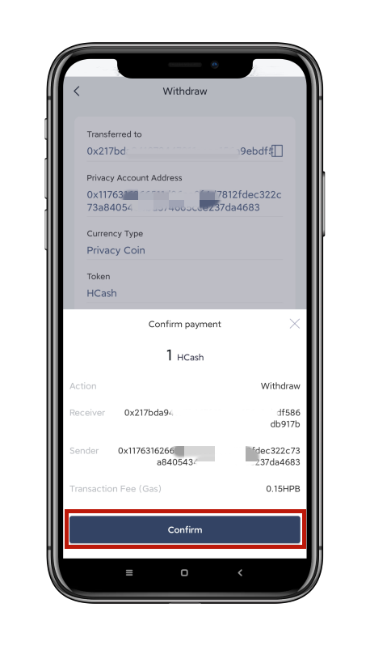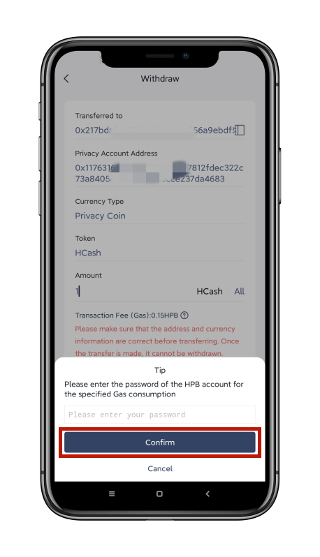

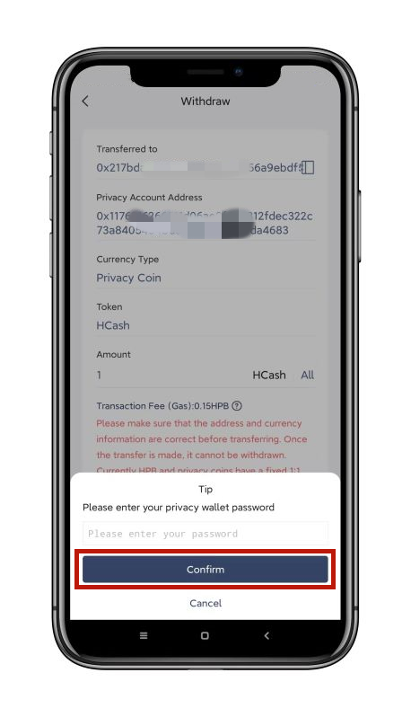

## **4. Delete the Privacy Wallet**

4.1 On the homepage of the Wallet, click【Me】-【Manage Wallet】-【Privacy 】tab
\- tap wallet【Delete Wallet】.

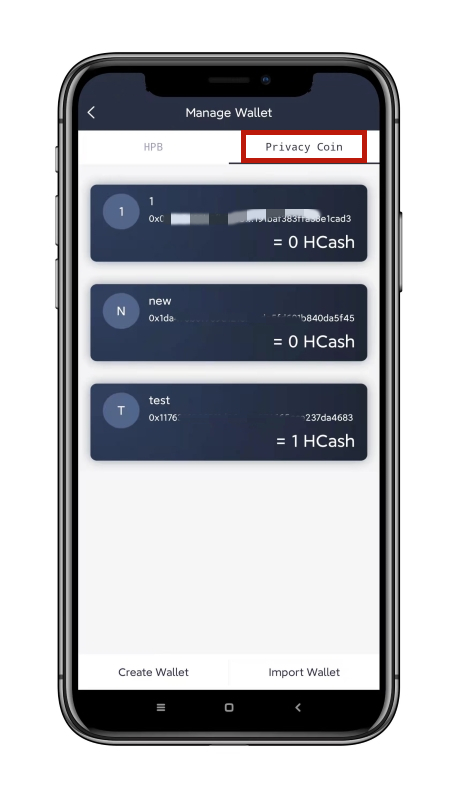

4.2 Select the Wallet that needs to be deleted and enter into the Wallet details
page.

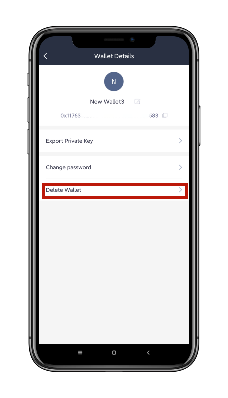

4.3 Click 【Delete the Wallet】, input the wallet payment password, then
click【Confirm】. The wallet is then deleted successfully.

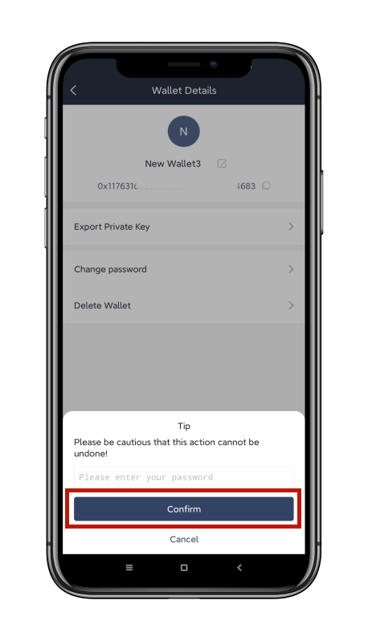
