**HPB机密支付使用手册** | [**(Switch To English)**](./README.md)

**HPB 基金会**

**2021 年 07 月**

**目录**

[一、简介 2](#)

[二、HPB 机密支付使用指南 2](#-1)

[1、创建及备份隐私钱包 2](#1创建及备份隐私钱包)

[2、导入隐私钱包 6](#2导入隐私钱包)

[3、隐私币管理及转账操作流程 7](#3隐私币管理及转账操作流程)

[4、删除隐私钱包 15](#-2)

## 

## 一、简介

DCPP(Decentralized Confidential Payment
Protocol，分布式机密支付协议)是一款软硬件结合的机密支付解决方案，实现极致高效、安全。软件部分架构在HPB区块链的智能合约层，以智能合约ZSC的形式部署在HPB区块链上，硬件部分结合了HPB独有BOE硬件加速芯片。HCash提供了以ElGaml公钥为账户的机密代币，作为HPB账户之间机密交易的载体。

## 

## 

## 二、HPB 机密支付使用指南

### 1、创建及备份隐私钱包

1.1打开 HPB Wallet进入主界面。

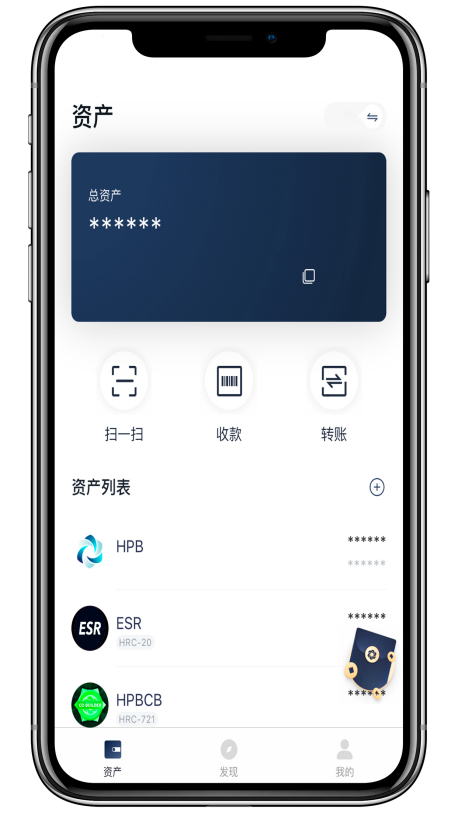

1.2点击【我的】-【管理钱包】。

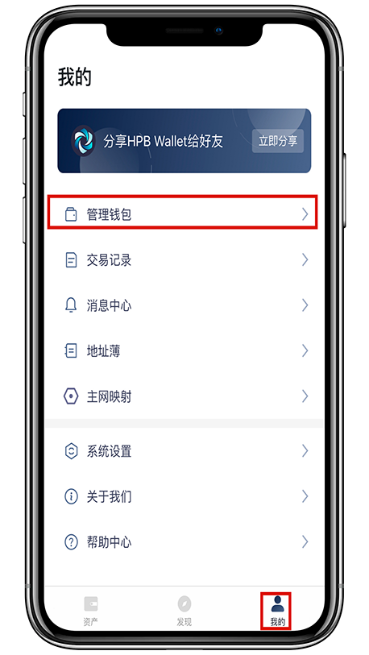

1.3点击【隐私币】-【创建钱包】。

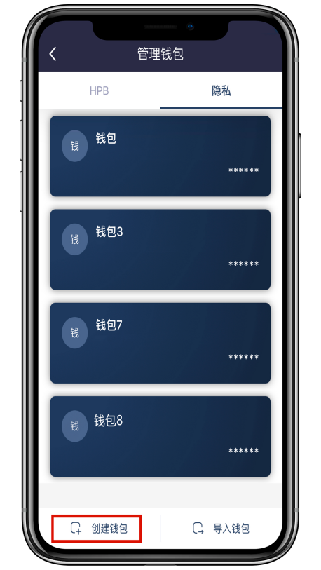

1.4按要求填写相关信息，阅读《隐私政策与服务条款》并勾选后，点击【创建钱包】。

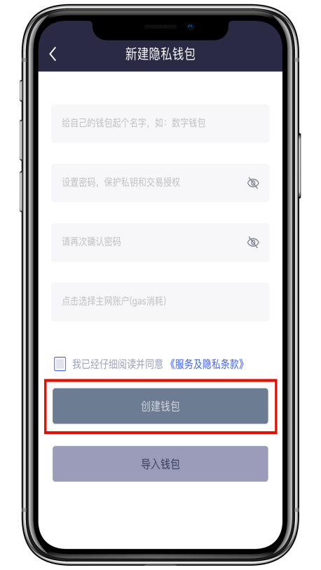

1.5点击【立即备份钱包】。

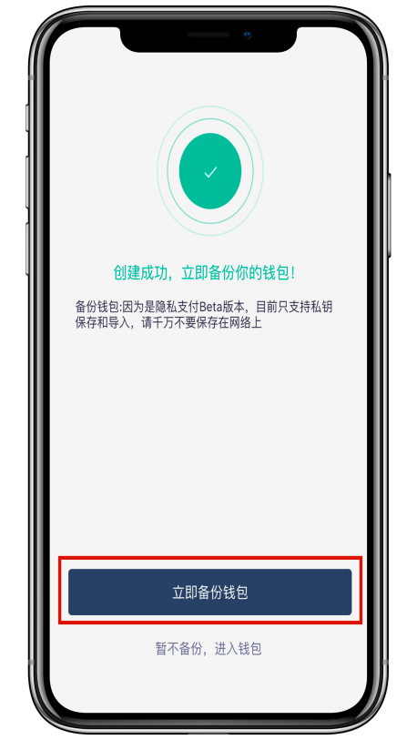

1.6复制私钥或者将私钥抄写保存在安全的地方，然后返回。

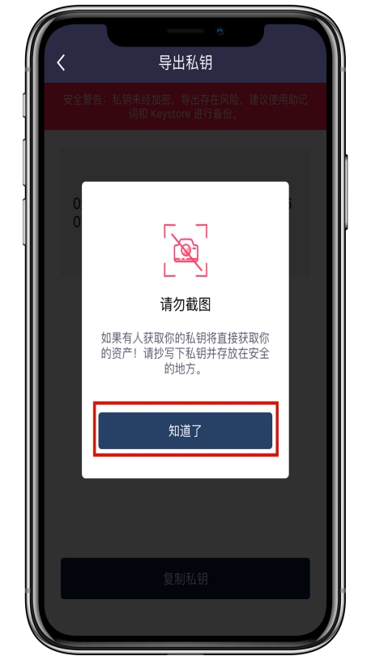

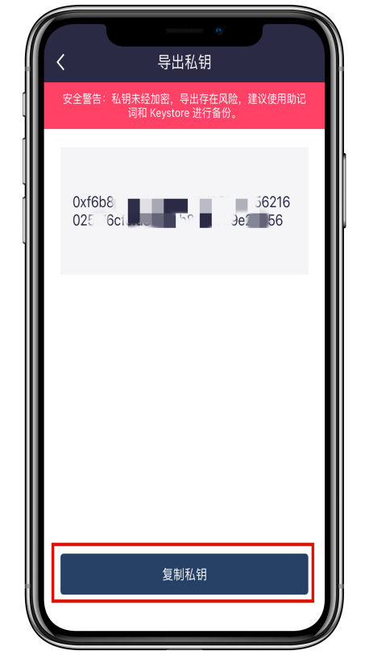

1.7暂不备份，进入钱包。此时钱包已经创建成功。

## 

## 2、导入隐私钱包

2.1在隐私币界面点击【导入钱包】

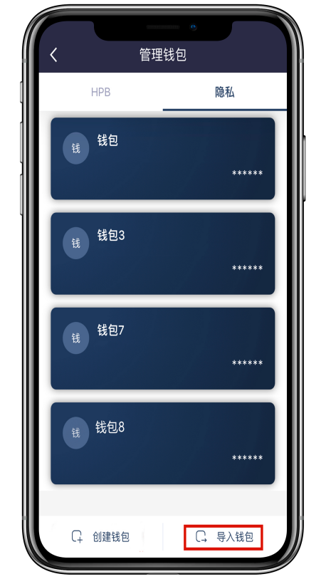

2.2输入明文私钥和密码及确认密码，在导入钱包前，请仔细阅读《隐私政策与服务条款》并勾选。点击【确认】。

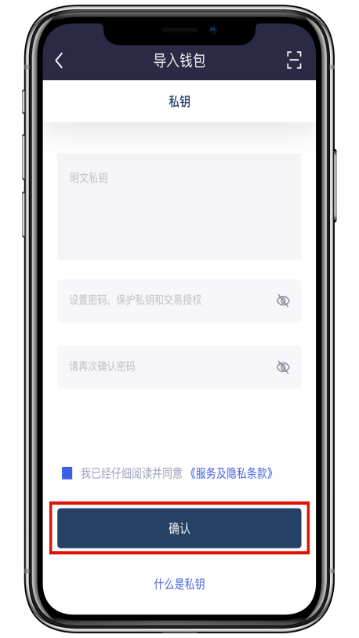

2.3恭喜！您的隐私钱包成功导入。

## 3、隐私币管理及转账操作流程

3、3.1
钱包首页【资产】页面，点击资产最右边切换符号，或者点击【我的】-【管理钱包】-【隐私币】，进行隐私币管理。

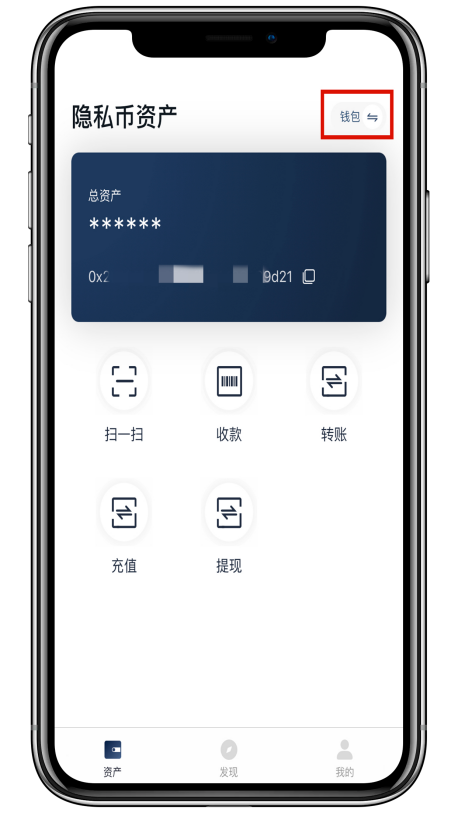

3、2.1隐私币充值说明：钱包首页点击【充值】进入充值界面。

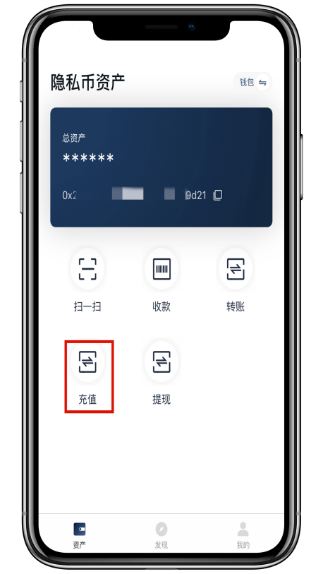

3、2.2按要求填写相关信息，点击【充值】。

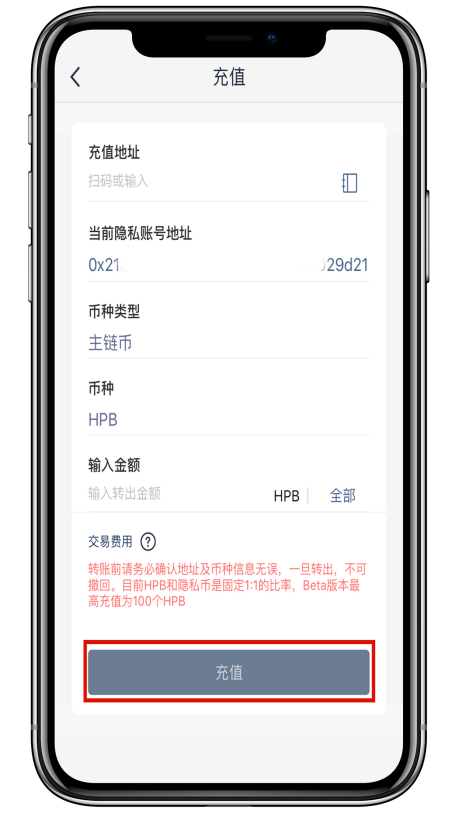

3、2.3在确认充值界面，仔细核对充值信息是否有误，有错误信息则点击【×】返回重新填写充值信息。确认无误点击【确认】，输入支付密码。充值成功返回首页

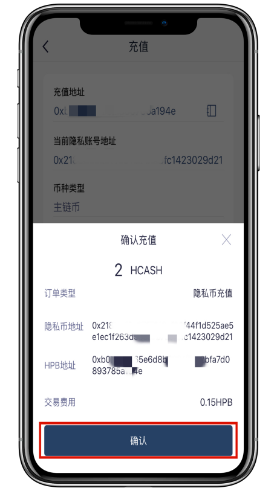

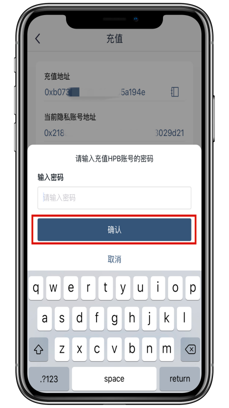

3、3.1隐私币资产转账说明：钱包首页点击【扫一扫】（扫描 HPB
收款码）或者点击【转账】进入到 转账页面。

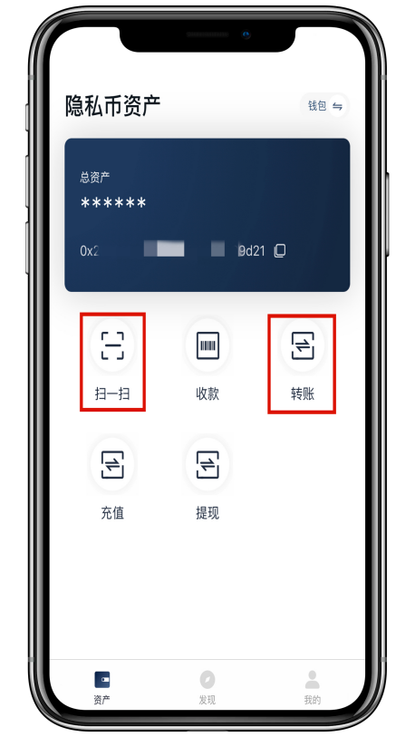

3、3.2输入收款地址，和选择有余额的主网账户，转账金额，点击【转账】。

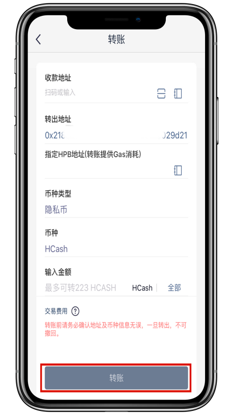

3、3.3在确认转账界面，仔细核对信息无误之后，点击【确认】，分别输入HPB支付密码和隐私币支付密码，转账成功返回首页。

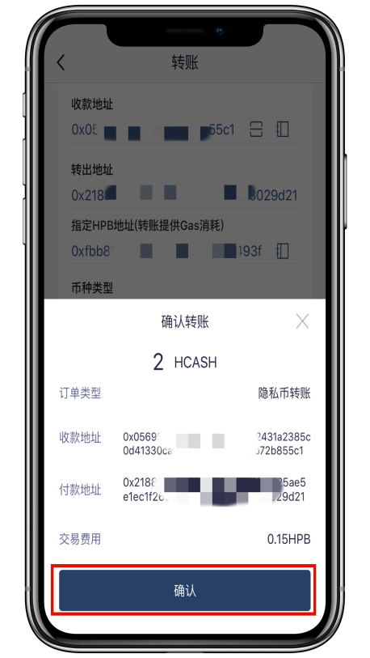

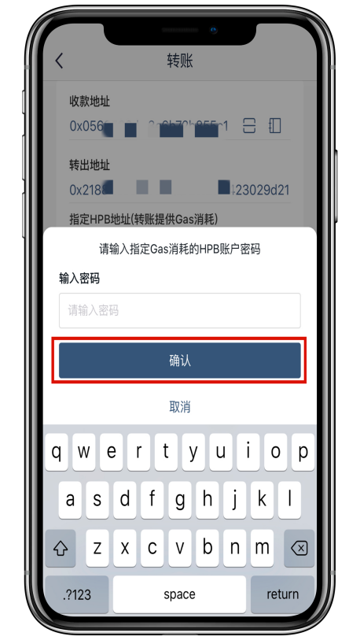

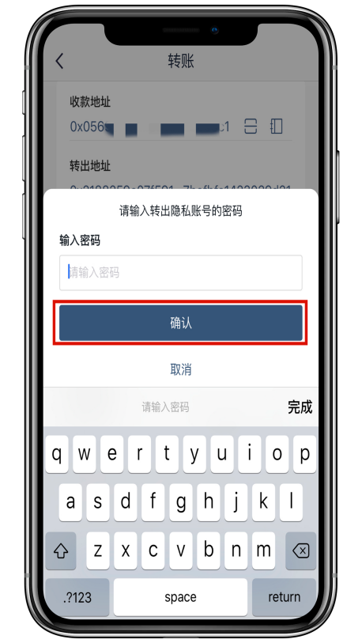

3、4.1隐私币体现说明：钱包首页点击【提现】进入提现界面。

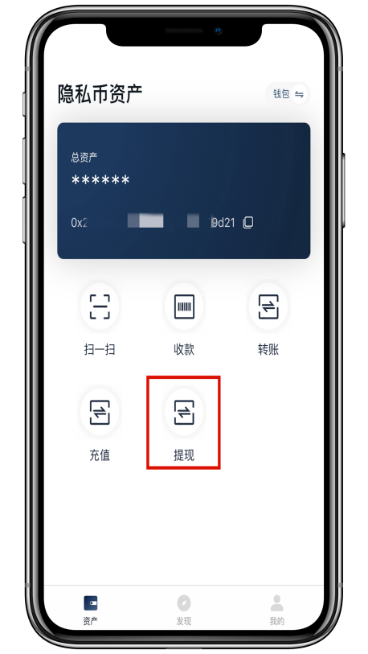

3、4.2按要求填写相关信息，点击【提现】。

3、4.3在确认提现界面，仔细核对提现信息是否有误，有错误信息则点击【×】返回重新填写提现信息。确认无误点击【确认】，分别输入HPB支付密码和隐私币支付密码。提现成功返回首页。

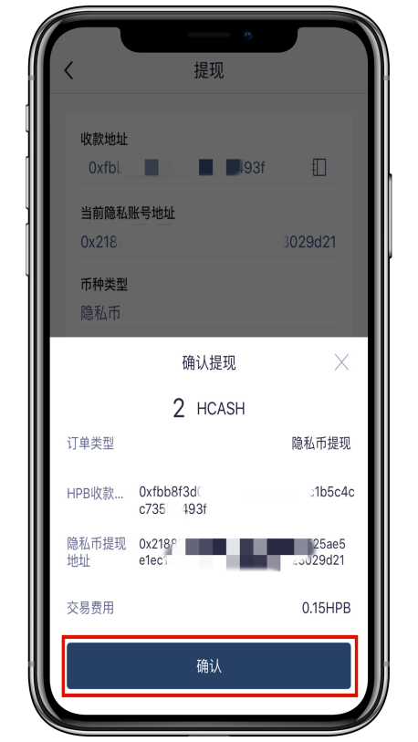

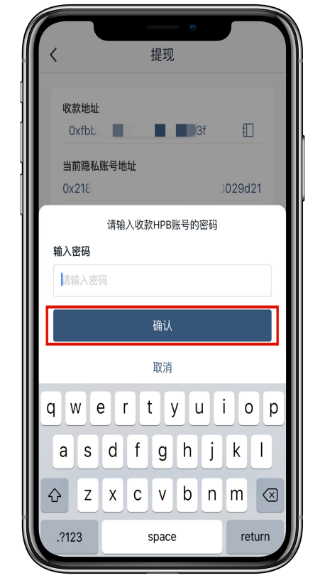

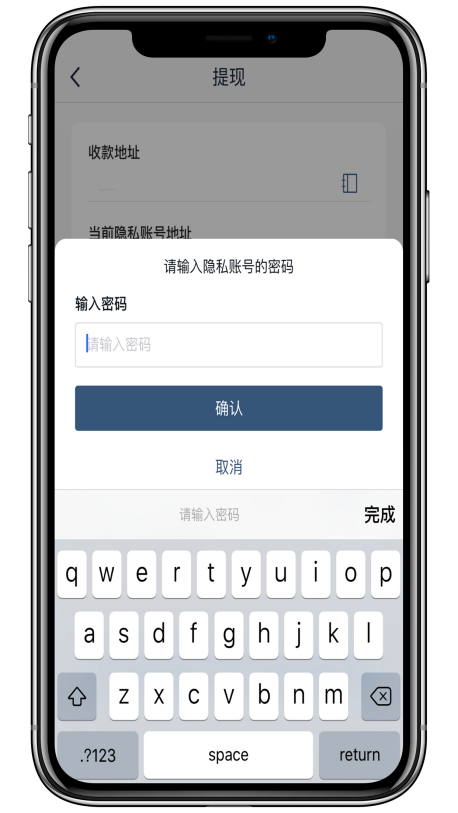

## 

## 

## 4、删除隐私钱包

4.1钱包首页【我的】页面-【管理钱包】-【隐私币】。

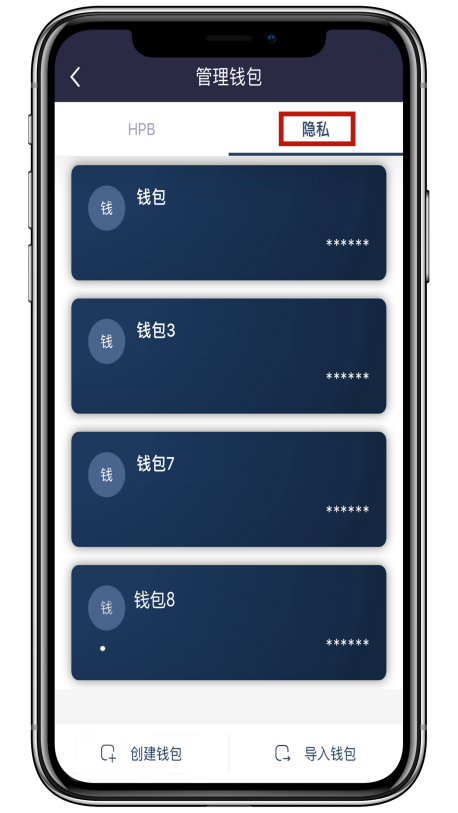

4.2选择需要删除的钱包，进入到钱包详情页。

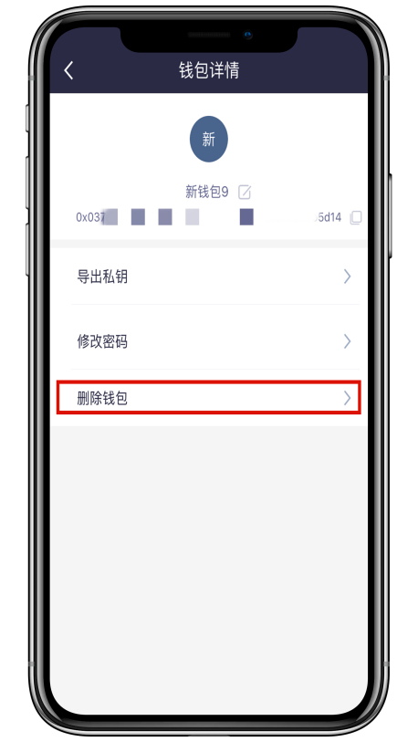

4.3点击【删除钱包】，输入钱包支付密码，点击【确认】。成功删除钱包。

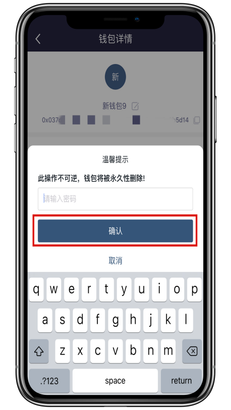
